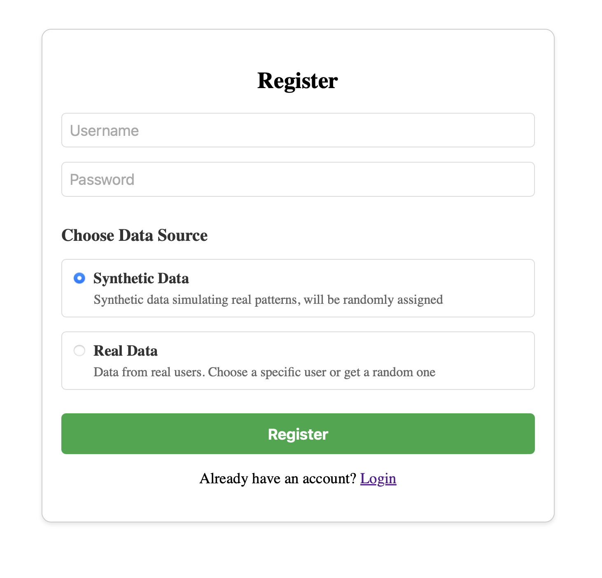
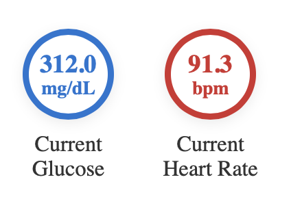
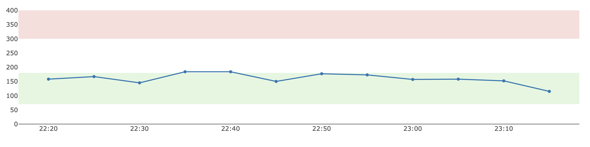
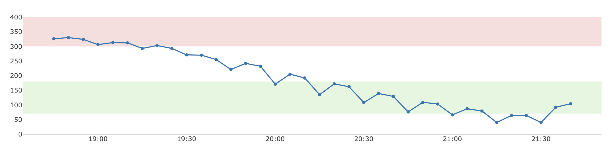
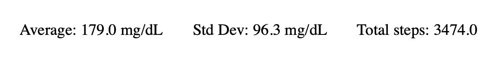

# CGM Simulator

## Prerequisites
- Python 3.x
- Node.js and npm
- Git

## Running the Application

### Using Bash (Linux/macOS)
1. Clone the repository:
```bash
git clone <repository-url>
cd <repository-name>
```

2. Set up and run the backend:
```bash
# Create and activate virtual environment
python3 -m venv .venv
source .venv/bin/activate

# Install Python dependencies
pip install -r requirements.txt

# Start the backend server
uvicorn app.main:app
```

3. Set up and run the frontend:
```bash
# Navigate to frontend directory
cd frontend

# Install Node.js dependencies
npm install
npm install react-plotly.js plotly.js
npm run dev
# The application will be running on http://localhost:5173
```

### Using PowerShell (Windows)
1. Clone the repository:
```powershell
git clone <repository-url>
cd <repository-name>
```

2. Set up and run the backend:
```powershell
# Create and activate virtual environment
python -m venv .venv
.\.venv\Scripts\Activate.ps1

# Install Python dependencies
pip install -r requirements.txt

# Start the backend server
uvicorn app.main:app
```

3. Set up and run the frontend:
```powershell
# Navigate to frontend directory
cd frontend

# Install Node.js dependencies
npm install
npm install react-plotly.js plotly.js
npm run dev
# The application will be running on http://localhost:5173
```

## Running Tests

Activate virtual environment (if not already activated)

Run all tests: pytest

Run tests with detailed output: pytest -v

## Project Structure (mainly)
- `app/` - Main application code, backend + ML model
- `frontend/` - Frontend application code
- `tests/` - Test files
- `data/` - Real data files
- `synthetic/` - Synthetic data files
- `requirements.txt` - Python dependencies

## Datasets

The application uses two publicly available datasets from [Mendeley Data](https://data.mendeley.com):

- **Simulated CGM Data**  
  [Dataset Link](https://data.mendeley.com/datasets/chd8hx65r4/2)  
  Contains synthetic glucose values over a single day. It was:
  - Reduced in size
  - Augmented with heart rate and step count
  - Processed using:
    - KMeans clustering
    - KDE (Kernel Density Estimation)
    - Random Forest regression models
    - Combining unsupervised and supervised learning approaches 

- **Real CGM Data**  
  [Dataset Link](https://data.mendeley.com/datasets/3hbcscwz44/1)  
  Contains real glucose time-series data from actual patients. Used for:
  - Validation
  - Advanced modeling

Both datasets were cleaned and saved as `.csv` files in the `data/` and `synthetic/` folders.

---

## Features

- Multi-user login system with session persistence (`.json` storage)

- 📊 Interactive dashboard with:
  - Time window selection (1h, 3h, etc.)
  - Live glucose and heart rate monitoring

  - Time-series visualization using Plotly


  - Automatic statistical summaries

-  Tested backend (statistical logic) using `pytest`
-  Modern tech stack: **FastAPI** (backend) + **React** (frontend)

---

## 🛠️ Possible Future Improvements

-  Anomaly detection (hypoglycemia/hyperglycemia)
-  Simulation of insulin, meals, and activity effects
-  Real-time notifications and device integration
-  SQL/NoSQL database support
-  Enhanced backend security (e.g., password hashing, input validation)
-  Backend optimization for high concurrency

---

##  References

- [Scikit-learn Documentation](https://scikit-learn.org/stable/)
- [React Documentation](https://react.dev/)
- [FastAPI Documentation](https://fastapi.tiangolo.com/)
- [Dexcom G7](https://www.dexcom.com/cs-CZ/dexcom-g7-cgm-system)
- [MySugr](https://www.mysugr.com/en)


